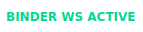
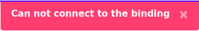
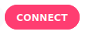
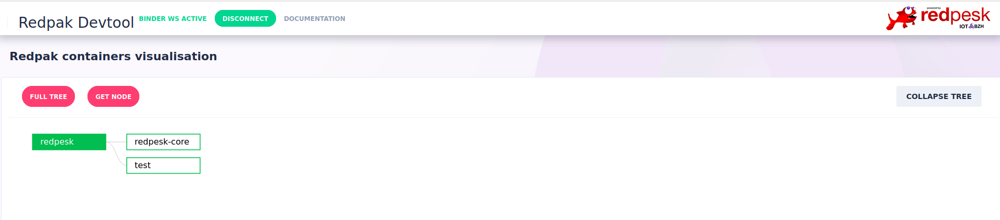
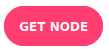
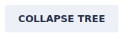
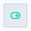

# Redpak Devtool

Redpak devtool provides a graphical representation of containers/nodes inheritance within a binding/board.

## Navigation Bar

At the top of the UI a  message means that a binding is currently running on your environment and is accessible. In case of disconnection a   message is displayed. The devtool will make 5 attempts to reconnect automatically, if all attempts fail a  message will appear.

In order to try to reconnect, press  button.
You can learn more about redpesk by pressing the  button.

### Containers visualisation

On successful connection to the binding full containers tree will be requested from the binding and top 2 levels will be displayed automatically.

In order to display a graph for a specific container and its children:
- Click the 
- In the dialog box, from the dropdown list, select a container as a top level parent
- Select the depth for the graph: 
  - **n == -1** for a full tree starting from the selected container
  - **n == 0** will display container without it's children
  - **n > 0** will display a graph for the selected container and **n** levels of children, grandchildren etc...
  - Click the  button, to display the graph
*(initially only the 2 top levels will be displayed)*
Click the  button, to collapse the graph except for the 2 top levels.
Click the  button, on top of the graph view, to display initial full tree view.

Hovering the mouse over a graph node will display a tooltip with its redpath *(containers installation path on the board)* and its children.
Clicking on a node will unfold its children nodes, if exist, and will open a configuration view.

### Container's congifuration details
 
 Once the hierarchy graph is displayed: 
- Click on the graph node to open a side window with it's configuration
- Click the  button to display merged configuration *( containers configuration and it's parent configuration )*
- Use search bar to find any string of characters within the configuration file *( minimum 3 characters are required)
- Click the  button to display merged configuration conflicts only
- Click the  button to open or collapse all configuration fields
- Click the  button to toggle full screen/normal mode for configuration window

  {:: style="margin:auto; display:flex; width:75%;"}
